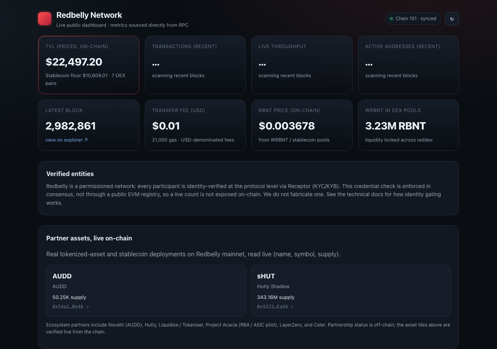

# Redbelly Network · Public Dashboard

A live, public dashboard of Redbelly Network metrics, sourced **directly from the Redbelly RPC** (no third-party data aggregator as the primary source). It auto-refreshes, shows a last-updated stamp, degrades gracefully to last-known values when the RPC is unreachable, and is fully responsive down to a 375px viewport.

**Live:** https://redbelly.smartcodedbot.com/dashboard



## Metrics (all from RPC)
| Metric | How it is sourced |
|---|---|
| TVL (priced) | reddex (Uniswap V2 fork) pair reserves via `eth_call`, priced with an **on-chain** RBNT price derived from the WRBNT/stablecoin pools. No external price feed. A stablecoin-only floor is also shown. |
| Transactions (windowed) | sum of tx counts over the last ~60 blocks (`eth_getBlockByNumber`), plus a 24h estimate from the live rate. |
| Live throughput (TPS) | window tx count divided by the timestamp span. |
| Active addresses (windowed) | unique `from`/`to` across the last ~60 blocks (full transactions). |
| Latest block, block time | `eth_blockNumber`, consecutive block timestamps. |
| Transfer fee (USD) | `eth_gasPrice` × 21,000 × the on-chain RBNT price (Redbelly fees are USD-denominated). |
| RBNT price | WRBNT/stablecoin pool ratio (on-chain). |
| Partner assets | live `name`/`symbol`/`totalSupply` reads of AUDD and Hutly sHUT. |

**Honest by design:** metrics that are not trustlessly derivable from RPC are not faked. "Verified entities" is shown qualitatively (Redbelly enforces identity at the protocol level, not via a public EVM registry), and all windowed metrics are labelled with their actual time window. See [`ARCHITECTURE.md`](ARCHITECTURE.md).

## Quick start
```bash
npm install
npm run dev        # local dev server
npm run build      # static bundle in ./dist
```

## Deploy (one command)
```bash
./deploy.sh vercel      # deploy to Vercel production
./deploy.sh selfhost    # build and serve on :4173 (any static host works)
./deploy.sh build       # just produce ./dist for your own static host
```
The app is a static client-side build that talks to the RPC from the browser (the RPC sends `access-control-allow-origin: *`), so `./dist` runs on any static host: Vercel, nginx, Caddy, GitHub Pages, S3, Netlify. See [`DEPLOYMENT.md`](DEPLOYMENT.md).

## Tech
React 18, TypeScript, and Vite, with [viem](https://viem.sh) as the RPC client (batched requests). No backend. Config in [`src/lib/chain.ts`](src/lib/chain.ts).

MIT licensed. Built by Smartcoded.
